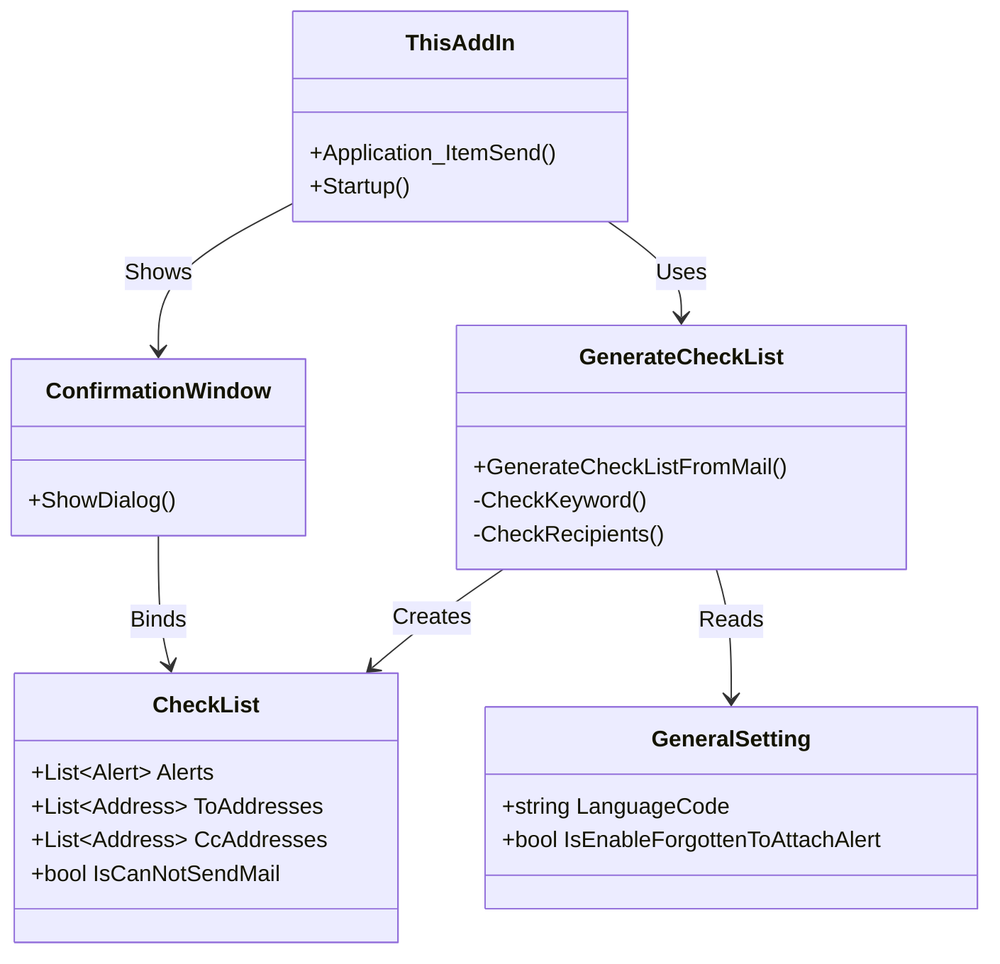

# OutlookOkan Architecture

## Overview
OutlookOkan is a VSTO (Visual Studio Tools for Office) Add-in for Microsoft Outlook. Its primary purpose is to prevent mis-sent emails by displaying a confirmation window before an email is sent. It performs various checks (keywords, recipients, attachments) based on user configuration.

## Core Components

### 1. Entry Point (`ThisAddIn.cs`)
- **Startup**: Loads settings (`LoadGeneralSetting`, `LoadSecurityForReceivedMail`).
- **Event Handlers**:
    - `Application_ItemSend`: Intercepts the send action. This is the main hook.
    - `CurrentExplorer_SelectionChange`: Monitors email selection for security checks (e.g., received mail analysis).
    - `BeforeAttachmentRead`: Checks attachements before opening.

### 2. Logic Layer (`Models/`)
- **`GenerateCheckList.cs`**: The core business logic.
    - Loads configuration from CSV/XML.
    - Analyzes the `MailItem` (Recipients, Body, Attachments).
    - Checks against rules (Whitelist, Keywords, etc.).
    - Returns a `CheckList` object containing alerts and confirmation items.
- **`CheckList.cs`**: Data structure holding the analysis results.

### 3. UI Layer (`Views/` & `ViewModels/`)
- **`ConfirmationWindow`**: The dialog shown to the user.
    - Displays alerts and requires user interaction to proceed.
- **`SettingsWindow`**: Interface for configuring the add-in.
- **`Ribbon`**: Adds a button to the Outlook ribbon to open Settings or About window.

## Data Flow (Mail Send)

```mermaid
sequenceDiagram
    participate User
    participant Outlook
    participant ThisAddIn
    participant GenerateCheckList
    participant ValidationLogic
    participant ConfirmationWindow

    User->>Outlook: Clicks Send
    Outlook->>ThisAddIn: Application_ItemSend
    ThisAddIn->>GenerateCheckList: GenerateCheckListFromMail(Item)
    GenerateCheckList->>GenerateCheckList: Load Settings (CSV)
    GenerateCheckList->>ValidationLogic: Check Keywords
    GenerateCheckList->>ValidationLogic: Check Recipients (To/Cc/Bcc)
    GenerateCheckList->>ValidationLogic: Check Attachments
    ValidationLogic-->>GenerateCheckList: Alerts & Check Items
    GenerateCheckList-->>ThisAddIn: CheckList Object
    
    alt If Blocking Rule Found
        ThisAddIn->>User: Show Error Message (Send Prohibited)
        ThisAddIn->>Outlook: Cancel Send
    else If Confirmation Needed
        ThisAddIn->>ConfirmationWindow: ShowDialog(CheckList)
        ConfirmationWindow->>User: Display Alerts & Checkboxes
        User->>ConfirmationWindow: Checks items & Clicks OK
        
        alt User Clicks OK
            ConfirmationWindow-->>ThisAddIn: Return True
            ThisAddIn->>Outlook: Allow Send
        else User Clicks Cancel
            ConfirmationWindow-->>ThisAddIn: Return False
            ThisAddIn->>Outlook: Cancel Send
        end
    else No Confirmation Needed
        ThisAddIn->>Outlook: Allow Send
    end
```

## Class Diagram



## Configuration
Configuration is stored in CSV files (typically in the User's AppData or alongside logic, handled by `CsvFileHandler`).
- `GeneralSetting.csv`
- `Whitelist.csv`
- `AlertKeywordAndMessageList.csv`
- ... (many others for specific features)

## Security
- **Received Mail Analysis**: Analyzes headers (SPF, DKIM, DMARC) and warns about suspicious attachments (Macros, Encrypted Zips).
- **Send Protection**: Prevents sending to external domains if configured, warns about missing attachments, etc.
