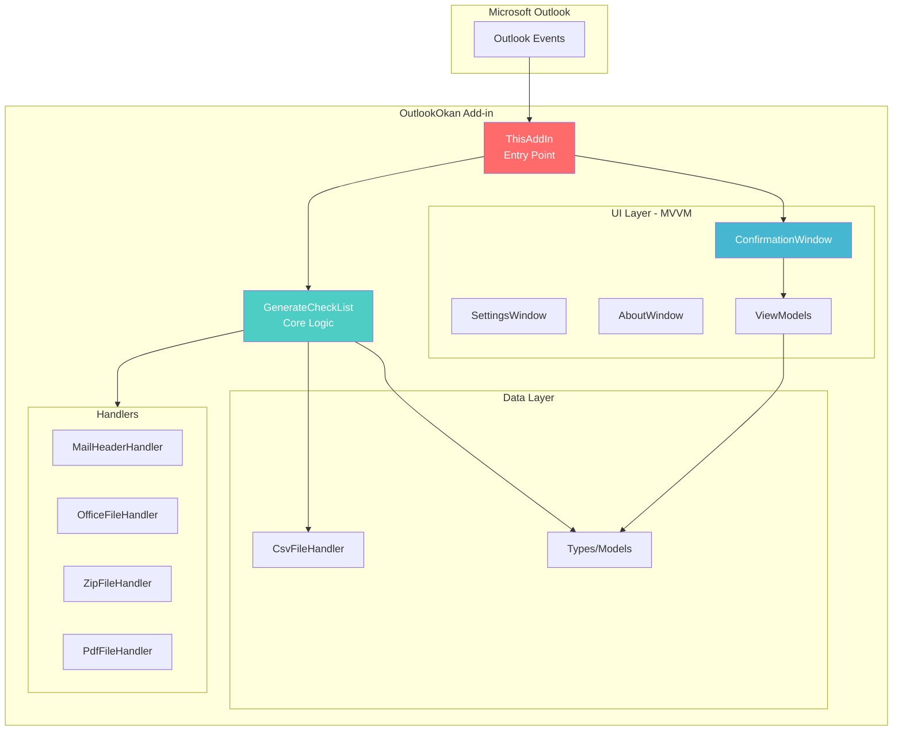
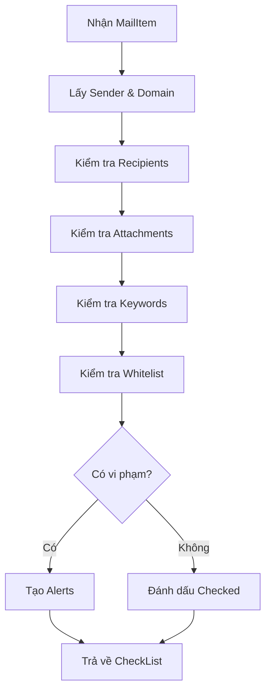
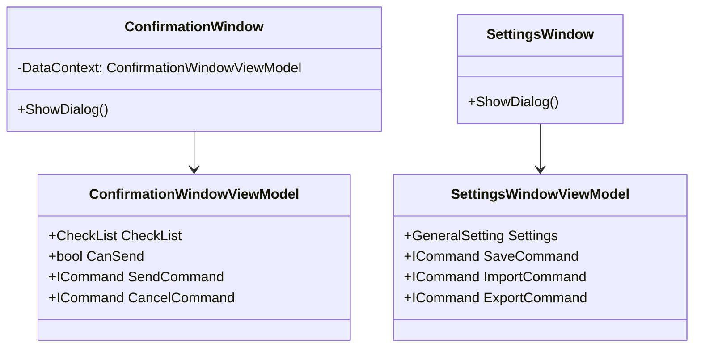
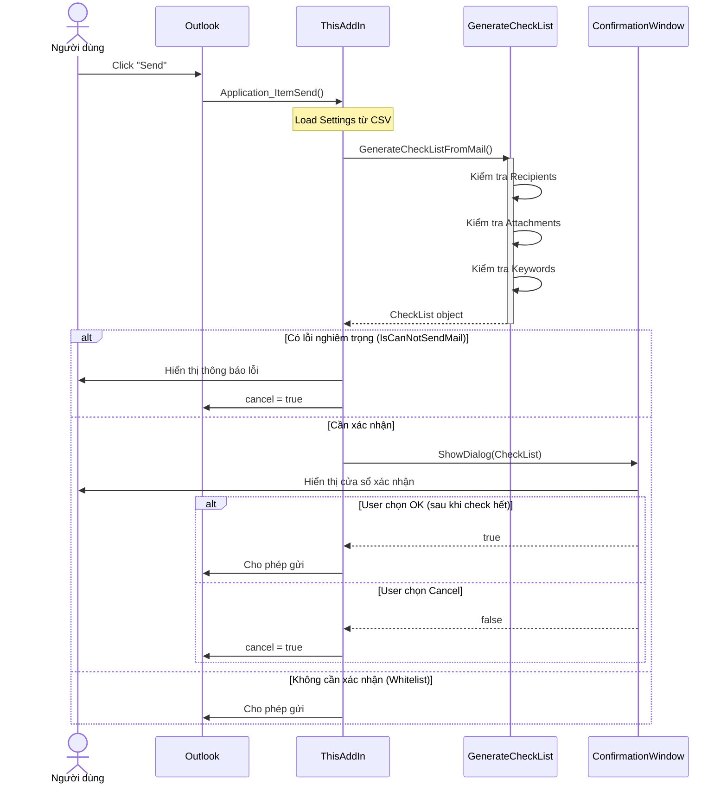
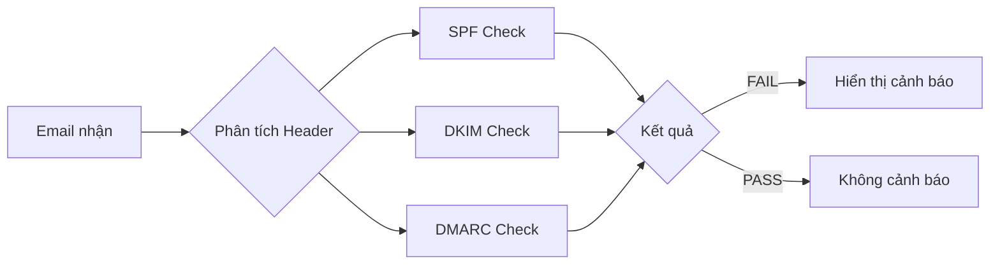

# Kiến Trúc OutlookOkan

## Tổng Quan

**OutlookOkan** (おかん for Outlook) là một VSTO Add-in cho Microsoft Outlook, được phát triển bằng C#/.NET Framework 4.6.2. Mục đích chính là **ngăn ngừa gửi email nhầm** bằng cách hiển thị cửa sổ xác nhận trước khi gửi email.

> [!NOTE]
> **VSTO** (Visual Studio Tools for Office) cho phép tích hợp sâu với Outlook thông qua COM interop.

---

## Cấu Trúc Thư Mục

```
OutlookOkan/
├── 📁 Handlers/          # Xử lý file (CSV, Mail Header, Office, PDF, ZIP)
├── 📁 Helpers/           # Native methods helper
├── 📁 Models/            # Business logic chính
├── 📁 Properties/        # Resources & Settings
├── 📁 Services/          # Dịch vụ (đa ngôn ngữ)
├── 📁 Types/             # Data models (29 types)
├── 📁 ViewModels/        # MVVM ViewModels
├── 📁 Views/             # WPF Windows
├── 📄 ThisAddIn.cs       # Entry point (858 dòng)
└── 📄 Ribbon.cs          # Ribbon integration
```

---

## Kiến Trúc Tổng Quan



---

## Các Thành Phần Chính

### 1. Entry Point - `ThisAddIn.cs`

**Chức năng**: Điểm vào chính của Add-in, xử lý các sự kiện từ Outlook.

| Event Handler | Mô Tả |
|:-------------|:------|
| `ThisAddIn_Startup` | Khởi tạo Add-in, load settings |
| `Application_ItemSend` | **Quan trọng nhất** - Chặn gửi email để kiểm tra |
| `CurrentExplorer_SelectionChange` | Phân tích email đã chọn |
| `BeforeAttachmentRead` | Cảnh báo trước khi mở attachment |

### 2. Core Logic - `GenerateCheckList.cs`

**Chức năng**: Xử lý business logic chính (2383 dòng code).



**Các phương thức chính:**

| Method | Chức năng |
|:-------|:---------|
| `GenerateCheckListFromMail()` | Phương thức chính, tạo CheckList từ email |
| `GetSenderAndSenderDomain()` | Lấy thông tin người gửi |
| `GetNameAndRecipient()` | Phân tích danh sách người nhận |
| `CountRecipientExternalDomains()` | Đếm domain bên ngoài |

### 3. UI Layer - Views & ViewModels

**Pattern**: MVVM (Model-View-ViewModel)



### 4. Handlers

| Handler | Chức năng |
|:--------|:---------|
| `CsvFileHandler` | Đọc/ghi settings từ CSV files |
| `MailHeaderHandler` | Phân tích SPF, DKIM, DMARC |
| `OfficeFileHandler` | Kiểm tra macro trong Office files |
| `ZipFileHandler` | Kiểm tra ZIP có mã hóa/lnk files |
| `PdfFileHandler` | Xử lý PDF files |

---

## Luồng Xử Lý Gửi Email



---

## Cấu Hình

Settings được lưu trữ dưới dạng **CSV files** tại:
```
%APPDATA%\Noraneko\OutlookOkan\
```

| File | Mô Tả |
|:-----|:------|
| `GeneralSetting.csv` | Cài đặt chung |
| `Whitelist.csv` | Danh sách cho phép |
| `InternalDomainList.csv` | Domain nội bộ |
| `AlertKeywordAndMessageList.csv` | Từ khóa cảnh báo |
| `AutoCcBccRecipientList.csv` | Tự động CC/BCC |
| `DeferredDeliveryMinutesList.csv` | Gửi trễ |

---

## Bảo Mật

### Phân Tích Email Nhận (Received Mail Security)



### Kiểm Tra Attachment

- ✅ ZIP có mã hóa
- ✅ File .lnk trong ZIP
- ✅ File .one (OneNote) trong ZIP
- ✅ Macro trong Office files (.docm, .xlsm, .pptm)

---

## Dependencies

| Package | Version | Mô Tả |
|:--------|:--------|:------|
| CsvHelper | 15.0.5 | Đọc/ghi CSV |
| Microsoft.Office.Interop.Outlook | 15.0.4797.1003 | Outlook COM |
| Microsoft.Office.Interop.Word | 15.0.4797.1003 | Word COM |
| SharpCompress | 0.37.2 | Xử lý ZIP |

---

## Đa Ngôn Ngữ

Add-in hỗ trợ **10 ngôn ngữ** thông qua `ResourceService`:

- 🇯🇵 Tiếng Nhật (mặc định)
- 🇺🇸 Tiếng Anh
- 🇨🇳 Tiếng Trung (Giản thể & Phồn thể)
- 🇰🇷 Tiếng Hàn
- 🇩🇪 Tiếng Đức
- 🇫🇷 Tiếng Pháp
- 🇪🇸 Tiếng Tây Ban Nha
- 🇵🇹 Tiếng Bồ Đào Nha
- 🇮🇹 Tiếng Ý
