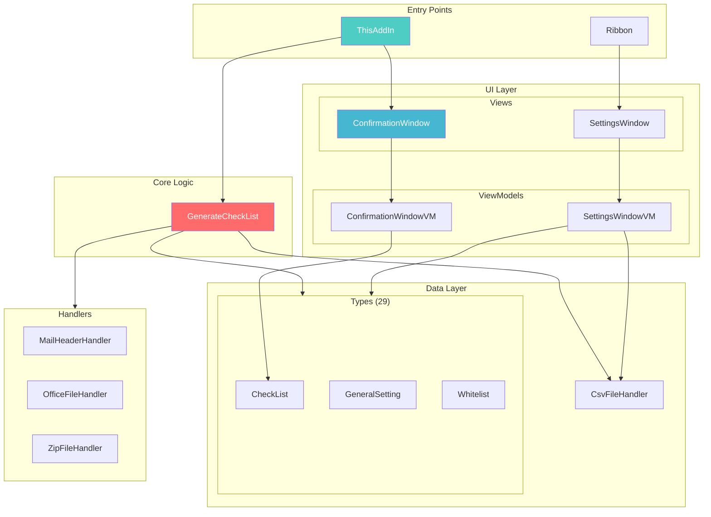

# Chi Tiết Các Module - OutlookOkan

## Tổng Quan

OutlookOkan bao gồm **60 file C#** được tổ chức thành các module rõ ràng:

| Module | Số File | Mô Tả |
|:-------|:-------:|:------|
| Handlers | 5 | Xử lý file (CSV, Mail, Office, PDF, ZIP) |
| Types | 29 | Data models & entities |
| ViewModels | 5 | MVVM ViewModels |
| Views | 3 | WPF Windows |
| Models | 2 | Business logic |
| Services | 1 | Dịch vụ hỗ trợ |
| Helpers | 1 | Native methods |

---

## 1. Handlers (`OutlookOkan/Handlers/`)

### 1.1 CsvFileHandler.cs
**Chức năng**: Đọc/ghi settings từ CSV files

| Method | Mô Tả |
|:-------|:------|
| `ReadCsv<T>()` | Đọc CSV thành list objects |
| `AppendCsv()` | Thêm record vào CSV |
| `CreateOrReplaceCsv()` | Tạo mới hoặc ghi đè CSV |
| `ImportCsv<T>()` | Import từ file người dùng chọn |
| `ExportCsv()` | Export ra file |

**Đường dẫn settings**: `%APPDATA%\Noraneko\OutlookOkan\`

### 1.2 MailHeaderHandler.cs
**Chức năng**: Phân tích email headers để phát hiện spoofing

| Method | Mô Tả |
|:-------|:------|
| `ValidateEmailHeader()` | Phân tích SPF, DKIM, DMARC |
| `DetermineDmarcResult()` | Tính DMARC từ SPF/DKIM |
| `IsInternalMail()` | Kiểm tra mail nội bộ |
| `ExtractMainDomain()` | Lấy domain chính |

### 1.3 OfficeFileHandler.cs
**Chức năng**: Kiểm tra macro trong Office files

| Method | Mô Tả |
|:-------|:------|
| `CheckOfficeFileHasVbProject()` | Kiểm tra có VBA project |

### 1.4 ZipFileHandler.cs
**Chức năng**: Phân tích ZIP files

| Property/Method | Mô Tả |
|:----------------|:------|
| `IncludeExtensions` | Các extension trong ZIP |
| `IsContainsShortcut` | Có file .lnk không |
| `CheckZipIsEncryptedAndGetIncludeExtensions()` | Kiểm tra mã hóa |

### 1.5 PdfFileHandler.cs
**Chức năng**: Xử lý PDF (hiện tại minimal)

---

## 2. Types (`OutlookOkan/Types/`)

### Core Types

| Type | Mô Tả |
|:-----|:------|
| `CheckList` | Kết quả phân tích email trước khi gửi |
| `Alert` | Cảnh báo hiển thị cho user |
| `Address` | Thông tin địa chỉ (To/Cc/Bcc) |
| `Attachment` | Thông tin file đính kèm |

### Setting Types

| Type | CSV File | Mô Tả |
|:-----|:---------|:------|
| `GeneralSetting` | GeneralSetting.csv | 20+ cài đặt chung |
| `Whitelist` | Whitelist.csv | Danh sách an toàn |
| `InternalDomain` | InternalDomainList.csv | Domain nội bộ |
| `AlertAddress` | AlertAddressList.csv | Địa chỉ cần cảnh báo |
| `AlertKeywordAndMessage` | AlertKeywordAndMessageList.csv | Từ khóa cảnh báo |

### Auto Action Types

| Type | Mô Tả |
|:-----|:------|
| `AutoCcBccRecipient` | Tự động CC/BCC theo recipient |
| `AutoCcBccKeyword` | Tự động CC/BCC theo keyword |
| `AutoCcBccAttachedFile` | Tự động CC/BCC khi có attachment |
| `AutoDeleteRecipient` | Tự động xóa recipient |
| `AutoAddMessage` | Tự động thêm text vào body |

### Security Types

| Type | Mô Tả |
|:-----|:------|
| `SecurityForReceivedMail` | Cài đặt bảo mật mail nhận |
| `AttachmentProhibitedRecipients` | Cấm gửi attachment |
| `ComErrorCodes` | Mã lỗi COM |

---

## 3. ViewModels (`OutlookOkan/ViewModels/`)

### 3.1 ConfirmationWindowViewModel.cs
**Chức năng**: Logic cho cửa sổ xác nhận gửi mail

| Property | Type | Mô Tả |
|:---------|:-----|:------|
| `ToAddresses` | ObservableCollection | Danh sách To |
| `CcAddresses` | ObservableCollection | Danh sách Cc |
| `BccAddresses` | ObservableCollection | Danh sách Bcc |
| `Attachments` | ObservableCollection | File đính kèm |
| `Alerts` | ObservableCollection | Cảnh báo |
| `CanSend` | bool | Có thể gửi không |

### 3.2 SettingsWindowViewModel.cs
**Chức năng**: Logic cho cửa sổ cài đặt

**Kích thước**: 94KB - **Lớn nhất trong project**

| Chức năng | Commands |
|:----------|:---------|
| Import/Export settings | ImportCommand, ExportCommand |
| Thêm/Sửa/Xóa records | AddCommand, EditCommand, DeleteCommand |
| Đa ngôn ngữ | LanguageChanged |

### 3.3 AboutWindowViewModel.cs
**Chức năng**: Hiển thị version info

### 3.4 RelayCommand.cs
**Chức năng**: ICommand implementation cho MVVM

### 3.5 ViewModelBase.cs
**Chức năng**: Base class với INotifyPropertyChanged

---

## 4. Views (`OutlookOkan/Views/`)

### 4.1 ConfirmationWindow
**File**: ConfirmationWindow.xaml (33KB)

```
┌─────────────────────────────────────┐
│  ⚠️ Cảnh báo (Alerts)              │
├─────────────────────────────────────┤
│  📧 Subject                         │
│  👤 Sender                          │
├─────────────────────────────────────┤
│  To:   [x] a@example.com           │
│        [x] b@external.com ← Đỏ     │
│  Cc:   [x] c@example.com           │
│  Bcc:  [x] d@example.com           │
├─────────────────────────────────────┤
│  📎 Attachments                     │
│        [x] document.pdf            │
├─────────────────────────────────────┤
│  📝 Mail Body Preview               │
├─────────────────────────────────────┤
│     [ Cancel ]        [ Send ]      │
└─────────────────────────────────────┘
```

### 4.2 SettingsWindow
**File**: SettingsWindow.xaml (143KB) - **Lớn nhất**

Gồm 15+ tabs cài đặt.

### 4.3 AboutWindow
**File**: AboutWindow.xaml (3KB)

Hiển thị version, license, links.

---

## 5. Models (`OutlookOkan/Models/`)

### 5.1 GenerateCheckList.cs
**Vai trò**: Core business logic

**Số dòng**: 2383 (cần refactor)

**Các phương thức chính**:

```csharp
// Entry point chính
public CheckList GenerateCheckListFromMail(
    dynamic item, 
    GeneralSetting generalSetting,
    MAPIFolder contacts,
    AutoAddMessage autoAddMessageSetting)

// Phân tích sender
private CheckList GetSenderAndSenderDomain(
    dynamic item, 
    CheckList checkList)

// Lấy thông tin recipient
private NameAndRecipient GetNameAndRecipient(
    Outlook.Recipient recipient)
```

### 5.2 CheckNewVersion.cs
**Chức năng**: Kiểm tra phiên bản mới

---

## 6. Services (`OutlookOkan/Services/`)

### ResourceService.cs
**Chức năng**: Quản lý đa ngôn ngữ

```csharp
// Singleton pattern
public static ResourceService Instance { get; }

// Đổi ngôn ngữ
public void ChangeCulture(string cultureCode);
```

---

## 7. Entry Points

### 7.1 ThisAddIn.cs
**Vai trò**: VSTO Add-in entry point

| Event | Handler |
|:------|:--------|
| Outlook Start | `ThisAddIn_Startup()` |
| Send Email | `Application_ItemSend()` |
| Select Email | `CurrentExplorer_SelectionChange()` |
| Open Attachment | `BeforeAttachmentRead()` |

### 7.2 Ribbon.cs
**Vai trò**: Outlook Ribbon integration

| Button | Action |
|:-------|:-------|
| Settings | Mở SettingsWindow |
| About | Mở AboutWindow |
| Help | Mở Wiki trên browser |
| Verify Header | Phân tích mail header đang chọn |

---

## Sơ Đồ Quan Hệ Module



---

## File Statistics

| File | Dòng | Bytes | Ghi chú |
|:-----|-----:|------:|:--------|
| GenerateCheckList.cs | 2,383 | 123KB | ⚠️ Cần refactor |
| UnitTest.cs | 1,288 | 72KB | 65 tests |
| ThisAddIn.cs | 858 | 48KB | Entry point |
| SettingsWindow.xaml | - | 143KB | 15+ tabs |
| SettingsWindowVM.cs | - | 94KB | ⚠️ Lớn |
