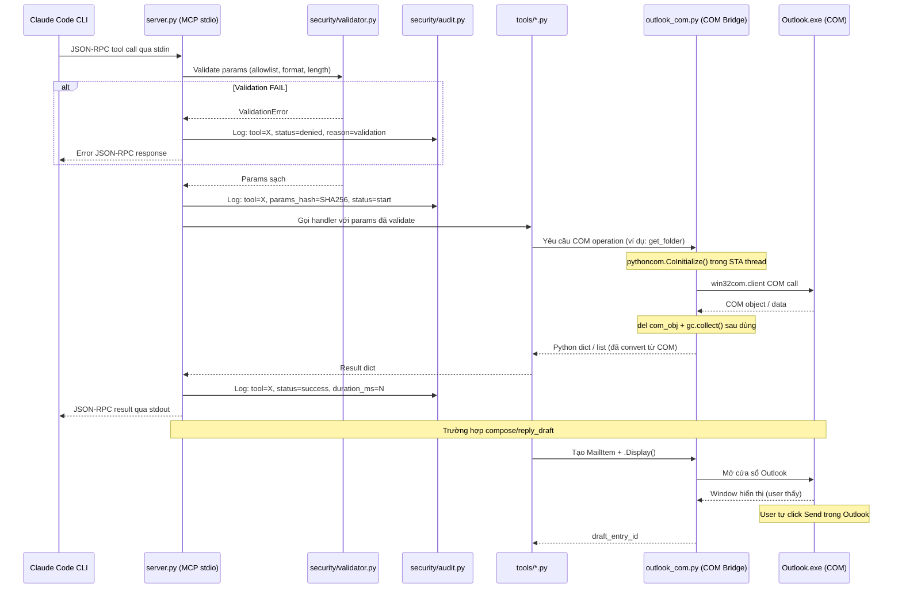

# Kiến Trúc Hệ Thống — outlook-mcp-secure

> MCP Server cho phép Claude Code CLI đọc, tìm kiếm và soạn email trong Microsoft Outlook  
> qua Windows COM automation, với các lớp bảo mật tích hợp.

---

## §1. Tổng Quan Kiến Trúc

`outlook-mcp-secure` là một **MCP server** (Model Context Protocol server — giao thức chuẩn để Claude giao tiếp với công cụ bên ngoài) chạy trên Windows, hoạt động như cầu nối giữa Claude Code CLI và Microsoft Outlook.

Giao tiếp hoàn toàn qua **stdio** (luồng stdin/stdout — không mở port mạng), đảm bảo server chỉ có thể truy cập từ process Claude trên cùng máy.

```
┌─────────────────────────────────────────────────────────────────────┐
│                        KIẾN TRÚC TỔNG QUAN                          │
└─────────────────────────────────────────────────────────────────────┘

  ┌───────────────┐    stdio JSON-RPC    ┌──────────────────────────┐
  │  Claude Code  │ ◄──────────────────► │  server.py               │
  │     CLI       │                      │  (MCP Server Entry Point) │
  └───────────────┘                      └────────────┬─────────────┘
                                                      │
                              ┌───────────────────────┼───────────────────────┐
                              │                       │                       │
                    ┌─────────▼──────┐     ┌──────────▼─────┐     ┌──────────▼──────┐
                    │  config.py     │     │  security/     │     │  tools/*.py     │
                    │  (AppConfig)   │     │  validator.py  │     │  (Tool handlers) │
                    │  config.toml   │     │  audit.py      │     │                 │
                    └────────────────┘     │  credential.py │     └──────────┬──────┘
                                           └────────────────┘                │
                                                                    ┌─────────▼──────┐
                                                                    │ outlook_com.py  │
                                                                    │ (COM Bridge)    │
                                                                    │ STA Thread      │
                                                                    └─────────┬──────┘
                                                                              │ win32com
                                                                    ┌─────────▼──────┐
                                                                    │ Outlook.exe     │
                                                                    │ (COM Automation)│
                                                                    └─────────┬──────┘
                                                                              │ MAPI
                                                                    ┌─────────▼──────┐
                                                                    │ Exchange / PST  │
                                                                    │ (Mail Storage)  │
                                                                    └────────────────┘
```

---

## §2. Luồng Dữ Liệu Chi Tiết

Mỗi tool call từ Claude đi qua các bước tuần tự sau:



**Tóm tắt luồng:**

1. Claude CLI gửi JSON-RPC qua stdin
2. `server.py` nhận và dispatch tool call
3. `security/validator.py` kiểm tra toàn bộ params — từ chối ngay nếu sai
4. `security/audit.py` ghi log bắt đầu (không log nội dung email)
5. Tool handler tương ứng trong `tools/` thực hiện logic nghiệp vụ
6. `outlook_com.py` thực hiện COM call trong STA thread riêng
7. Outlook trả về COM object — được convert sang Python dict ngay lập tức
8. Kết quả truyền ngược lên Claude qua stdout

---

## §3. Thành Phần Hệ Thống

| File | Vai Trò |
|------|---------|
| `server.py` | Điểm vào chính. Khởi tạo FastMCP/Server với stdio transport, đăng ký tất cả tools, load `config.toml`, khởi tạo `AuditLogger` và `OutlookCOMBridge`. Chạy `asyncio.run(server.run())`. |
| `config.py` | Đọc và validate `config.toml` bằng dataclass + tomllib (Python 3.11+). Expose `AppConfig` với các sub-config: `SecurityConfig`, `AuditConfig`, `OutlookConfig`. Singleton pattern với lazy load. |
| `outlook_com.py` | Context manager `OutlookCOMBridge` bọc toàn bộ `win32com.client.Dispatch('Outlook.Application')`. Xử lý `CoInitialize`/`CoUninitialize` trong STA thread. Expose: `get_namespace()`, `get_folder_by_path()`, `list_mail_items()`, `get_mail_item_by_id()`, `create_draft()`, `open_reply_window()`. |
| `security/__init__.py` | Re-export: `CredentialManager`, `AuditLogger`, `InputValidator`. Khởi tạo `audit_logger` singleton dùng toàn hệ thống. |
| `security/credential.py` | `CredentialManager` dùng thư viện `keyring` để đọc/ghi Windows Credential Manager. Không bao giờ log hoặc trả về plain-text credentials. |
| `security/audit.py` | `AuditLogger` ghi JSON Lines vào file log. Fields: `timestamp`, `tool_name`, `params_hash` (SHA256), `caller_pid`, `result_status`, `duration_ms`. Không ghi email content. Hỗ trợ log rotation theo ngày. |
| `security/validator.py` | `InputValidator` với static methods: `validate_folder_name()`, `validate_email_id()`, `validate_search_query()`, `validate_email_address()`, `sanitize_string()`. |
| `tools/__init__.py` | Re-export tất cả tool handlers để `server.py` import gọn. |
| `tools/list_folders.py` | Handler cho `list_folders`. Enumerate top-level folders từ MAPI namespace, filter theo allowlist. |
| `tools/read_email.py` | Handlers cho `list_emails` và `read_email`. Metadata-only hoặc full content theo EntryID. Body HTML được strip tags. |
| `tools/search.py` | Handler cho `search_emails`. Dùng `Items.Restrict()` với DASL filter, giới hạn kết quả theo `config.max_results`. |
| `tools/compose.py` | Handlers cho `compose_draft` và `reply_draft`. Tạo MailItem, gọi `.Display()` — **không bao giờ gọi `.Send()`**. |
| `requirements.txt` | Dependencies: `mcp>=1.0.0`, `pywin32>=306`, `keyring>=24.0.0`, `tomli>=2.0.0`. Dev: `pytest`, `pytest-asyncio`. |
| `setup.ps1` | Tạo Python venv, install dependencies, copy `config.toml.example`, tạo thư mục `logs/`. |
| `claude-mcp.json` | Cấu hình MCP cho Claude Code CLI. Khai báo `mcpServers.outlook-secure` với stdio transport. |

---

## §4. MCP Tools — Tài Liệu Đầy Đủ

### 4.1 `list_folders`

**Mô tả:** Liệt kê các thư mục email Claude được phép truy cập theo allowlist trong `config.toml`.

**Params:**
```json
{
  "include_subfolders": { "type": "boolean", "default": false }
}
```

**Returns:**
```json
{
  "folders": [
    { "name": "string", "path": "string", "unread_count": 0, "total_count": 0 }
  ]
}
```

**Lưu ý bảo mật:** Filter theo `folder_allowlist` trước khi trả về. PST file path không bao giờ được expose. Log tool call vào `audit.log` không kèm nội dung.

---

### 4.2 `list_emails`

**Mô tả:** Lấy danh sách email trong một thư mục — chỉ metadata, không lấy body để tiết kiệm context window.

**Params:**
```json
{
  "folder_path":  { "type": "string",  "required": true, "example": "Inbox/Projects" },
  "limit":        { "type": "integer", "default": 20,   "maximum": 100 },
  "offset":       { "type": "integer", "default": 0 },
  "unread_only":  { "type": "boolean", "default": false }
}
```

**Returns:**
```json
{
  "emails": [
    {
      "entry_id": "string", "subject": "string",
      "sender_name": "string", "sender_email": "string",
      "received_time": "ISO8601", "has_attachment": true,
      "is_read": false, "size_kb": 0
    }
  ],
  "total": 0
}
```

**Lưu ý bảo mật:** `validate_folder_name()` kiểm tra allowlist. `limit` bị cap tại `config.max_results`. `entry_id` được hash trong audit log.

---

### 4.3 `read_email`

**Mô tả:** Đọc nội dung đầy đủ của một email theo Entry ID. Body HTML tự động strip thành plain text.

**Params:**
```json
{
  "entry_id": { "type": "string", "required": true, "description": "Outlook Entry ID từ list_emails" }
}
```

**Returns:**
```json
{
  "subject": "string", "sender_name": "string", "sender_email": "string",
  "to_recipients": ["string"], "cc_recipients": ["string"],
  "received_time": "ISO8601", "body_text": "string",
  "attachments": [{ "name": "string", "size_kb": 0, "extension": "string" }]
}
```

**Lưu ý bảo mật:** `validate_email_id()` kiểm tra định dạng hex, max 256 chars. Email body không bao giờ ghi vào audit log. Folder của email phải thuộc allowlist.

---

### 4.4 `search_emails`

**Mô tả:** Tìm kiếm email qua DASL filter của Outlook COM. Nhanh hơn vòng lặp Python vì filter chạy ở tầng MAPI.

**Params:**
```json
{
  "query":       { "type": "string",  "required": true, "maxLength": 200 },
  "folder_path": { "type": "string",  "description": "Bỏ trống để tìm tất cả folders được phép" },
  "search_in":   { "type": "string",  "enum": ["subject","body","sender","all"], "default": "subject" },
  "date_from":   { "type": "string",  "format": "date" },
  "date_to":     { "type": "string",  "format": "date" },
  "limit":       { "type": "integer", "default": 20, "maximum": 50 }
}
```

**Returns:**
```json
{
  "results": [
    {
      "entry_id": "string", "subject": "string",
      "sender_email": "string", "received_time": "ISO8601",
      "folder_path": "string", "snippet": "string"
    }
  ],
  "total_found": 0
}
```

**Lưu ý bảo mật:** `validate_search_query()` strip SQL/DASL injection patterns. Query string được hash (SHA256) trong audit log — không log plaintext.

---

### 4.5 `compose_draft`

**Mô tả:** Tạo email nháp mới và mở cửa sổ Outlook. Claude **không tự gửi** — user phải click Send.

**Params:**
```json
{
  "to":         { "type": "array", "items": {"format": "email"}, "required": true },
  "cc":         { "type": "array", "items": {"format": "email"} },
  "subject":    { "type": "string", "required": true, "maxLength": 500 },
  "body":       { "type": "string", "required": true, "maxLength": 50000 },
  "importance": { "type": "string", "enum": ["low","normal","high"], "default": "normal" }
}
```

**Returns:**
```json
{
  "status": "draft_opened",
  "message": "Cửa sổ soạn email đã mở trong Outlook. Vui lòng xem lại và nhấn Send để gửi.",
  "draft_entry_id": "string"
}
```

**Lưu ý bảo mật:** Yêu cầu `read_only_mode = false`. Mỗi địa chỉ qua `validate_email_address()`. Gọi `.Display()` không `.Send()`. Tối đa 50 recipients. Audit log chỉ ghi hash của địa chỉ và subject.

---

### 4.6 `reply_draft`

**Mô tả:** Tạo bản trả lời cho email có sẵn và mở cửa sổ Outlook. Hỗ trợ Reply và Reply All.

**Params:**
```json
{
  "entry_id":      { "type": "string",  "required": true },
  "body":          { "type": "string",  "required": true, "maxLength": 50000 },
  "reply_all":     { "type": "boolean", "default": false },
  "additional_cc": { "type": "array",   "items": {"format": "email"} }
}
```

**Returns:**
```json
{
  "status": "reply_opened",
  "message": "Cửa sổ trả lời đã mở trong Outlook. Vui lòng xem lại và nhấn Send để gửi.",
  "reply_entry_id": "string"
}
```

**Lưu ý bảo mật:** Yêu cầu `read_only_mode = false`. Email gốc phải thuộc allowlist. Gọi `.Reply()`/`.ReplyAll()` rồi `.Display()` — không `.Send()`.

---

## §5. Các Lớp Bảo Mật

Hệ thống có **12 lớp kiểm soát bảo mật** xếp chồng theo chiều sâu:

### Lớp 1 — Folder Allowlist

`config.toml [security] allowed_folders`. Mọi tool call đều qua `validate_folder_name()`. Từ chối nếu không có trong list. Default chỉ cho phép `Inbox`.

Wildcard (`*`) bị cấm — validator từ chối với lỗi `INVALID_FOLDER_PATTERN`.

### Lớp 2 — Read-Only Mode

`config.toml read_only_mode = true` (mặc định bật). Khi bật, `compose_draft` và `reply_draft` trả về lỗi `WRITE_DISABLED` ngay tại `server.py` trước khi gọi tool handler.

### Lớp 3 — Windows Credential Manager

`keyring.set_password()` / `keyring.get_password()` cho bất kỳ secret nào cần lưu. Credentials không bao giờ xuất hiện trong `config.toml` hay file plain text.

### Lớp 4 — Audit Log JSON Lines

Mỗi tool call ghi một dòng JSON vào `logs/audit_YYYY-MM-DD.jsonl`:

```json
{
  "timestamp": "2025-06-23T10:15:30.123Z",
  "tool": "read_email",
  "params_hash": "sha256:a3f9c2...",
  "pid": 12345,
  "status": "success",
  "duration_ms": 87
}
```

**Không bao giờ ghi:** email body, subject plaintext, sender, credentials.

### Lớp 5 — Input Validation

| Validator | Kiểm tra |
|-----------|----------|
| `validate_folder_name()` | Exact match với allowlist |
| `validate_email_id()` | Hex string, max 256 chars |
| `validate_search_query()` | Max 200 chars, strip `<script>`, `--`, `;`, DASL injection |
| `validate_email_address()` | RFC5322 regex |
| `sanitize_string()` | Strip null bytes `\x00`, control chars `\x01–\x1f` |

### Lớp 6 — COM Object Lifecycle

`OutlookCOMBridge` dùng context manager `__enter__`/`__exit__`. Trong `__exit__`: `del` tất cả COM objects trong `self._refs`, `gc.collect()`, rồi `pythoncom.CoUninitialize()`. Tránh memory leak và zombie COM process.

### Lớp 7 — STA Threading Model

Toàn bộ COM calls chạy trong một thread duy nhất với `CoInitialize(COINIT_APARTMENTTHREADED)`. MCP tools dispatch sang COM thread qua `ThreadPoolExecutor(max_workers=1)` — tránh cross-thread COM access.

### Lớp 8 — No Direct Send Policy

`compose_draft` và `reply_draft` gọi `.Display()` để mở cửa sổ Outlook, **tuyệt đối không gọi `.Send()`**.

Checklist code review: `grep -r '\.Send()' tools/compose.py` phải trả về 0 kết quả.

### Lớp 9 — Error Message Sanitization

Mọi exception từ COM layer (`pywintypes.error`, `pythoncom.error`) được catch trong `outlook_com.py` và convert thành generic message. Chi tiết chỉ ghi vào internal log, không trả về Claude.

### Lớp 10 — Localhost-Only Binding

MCP stdio transport không dùng network socket. Không có HTTP server, không có port mở. Giao tiếp hoàn toàn qua stdin/stdout pipe — inherently localhost-only.

### Lớp 11 — Log Rotation

`AuditLogger` tự động tạo file mới theo ngày: `logs/audit_YYYY-MM-DD.jsonl`. Giữ tối đa `config [audit] retain_days = 30` file. File cũ tự xóa khi server khởi động.

### Lớp 12 — Config Integrity

`config.toml` không chứa credentials. Wildcard trong `allowed_folders` bị từ chối. Config không thể mở rộng quyền truy cập ra ngoài allowlist.

---

## §6. Threading Model — COM STA

### Tại Sao COM Cần STA Thread Riêng?

Windows COM (Component Object Model) Outlook chạy theo mô hình **STA — Single-Threaded Apartment** (căn hộ đơn luồng — mỗi COM object chỉ được truy cập từ một thread duy nhất đã khởi tạo nó). Nếu gọi COM object từ thread khác, Windows sẽ raise `RPC_E_WRONG_THREAD` hoặc gây crash im lặng.

`server.py` chạy asyncio event loop (đa luồng logically), nhưng COM calls bắt buộc phải đồng bộ, một thread. Giải pháp:

```
asyncio event loop (main thread)
    │
    │  await loop.run_in_executor(...)
    ▼
ThreadPoolExecutor(max_workers=1)  ← COM thread duy nhất
    │
    │  pythoncom.CoInitialize()
    ▼
win32com.client.Dispatch('Outlook.Application')
```

### Pattern Triển Khai

```python
# server.py — COM thread executor
_com_executor = ThreadPoolExecutor(max_workers=1, thread_name_prefix='outlook-com')

async def run_in_com_thread(func, *args, **kwargs):
    """Chạy COM operation trong COM thread, await từ asyncio event loop."""
    loop = asyncio.get_event_loop()
    return await loop.run_in_executor(_com_executor, lambda: func(*args, **kwargs))
```

```python
# outlook_com.py — Context manager COM lifecycle
class OutlookCOMBridge:
    def __enter__(self):
        # Bước 1: Khởi tạo COM STA trong thread hiện tại (phải là COM thread)
        pythoncom.CoInitialize()
        try:
            self._app = win32com.client.Dispatch('Outlook.Application')
            self._refs.append(self._app)
            return self
        except Exception:
            pythoncom.CoUninitialize()
            raise

    def __exit__(self, exc_type, exc_val, exc_tb):
        # Bước 2: Release tất cả COM objects theo thứ tự ngược lại
        for ref in reversed(self._refs):
            try:
                del ref
            except Exception:
                pass
        self._refs.clear()
        # Bước 3: Buộc Python garbage collect COM references
        gc.collect()
        # Bước 4: Uninitialize COM
        pythoncom.CoUninitialize()
        return False
```

### Quy Tắc Vàng COM

1. **Không bao giờ lưu COM object vượt qua ranh giới hàm** — convert sang Python dict/list ngay khi lấy về.
2. **Luôn `del` COM object + `gc.collect()` sau dùng** — Python không tự release COM references kịp thời.
3. **Không truyền COM object giữa các thread** — ngay cả qua queue hay callback.
4. **Mọi COM call phải nằm trong context manager** của `OutlookCOMBridge`.

---

## §7. Cách Thêm Tool Mới

Để thêm một MCP tool mới (ví dụ: `move_email` — di chuyển email sang thư mục khác):

### Bước 1 — Tạo file handler

Tạo `tools/move_email.py`:

```python
# tools/move_email.py
# Handler cho tool move_email — di chuyển email sang thư mục khác trong allowlist

from security.validator import InputValidator
from outlook_com import OutlookCOMBridge


def move_email_handler(entry_id: str, target_folder: str, config) -> dict:
    """
    Di chuyển một email (xác định bởi entry_id) sang thư mục target_folder.
    Cả email gốc và thư mục đích đều phải thuộc allowlist.
    
    Trả về: {"status": "moved", "new_entry_id": "...", "target_folder": "..."}
    """
    # Bước 1: Validate đầu vào trước khi chạm vào COM
    validator = InputValidator(config.security)
    validator.validate_email_id(entry_id)
    validator.validate_folder_name(target_folder)  # Kiểm tra allowlist

    # Bước 2: Thực hiện COM operation trong context manager
    with OutlookCOMBridge() as bridge:
        mail_item = bridge.get_mail_item_by_id(entry_id)
        
        # Bước 3: Kiểm tra folder gốc cũng phải trong allowlist
        source_folder = mail_item.Parent.Name
        validator.validate_folder_name(source_folder)
        
        # Bước 4: Lấy folder đích và di chuyển
        target = bridge.get_folder_by_path(target_folder)
        mail_item.Move(target)
        
        # Bước 5: Convert kết quả sang Python dict ngay lập tức
        result = {
            "status": "moved",
            "target_folder": target_folder,
        }
        # Bước 6: Release COM objects trước khi ra khỏi context manager
        del mail_item, target
        import gc; gc.collect()
        
    return result
```

### Bước 2 — Export từ `tools/__init__.py`

```python
# tools/__init__.py — thêm dòng này
from tools.move_email import move_email_handler
```

### Bước 3 — Đăng ký tool trong `server.py`

```python
# server.py — thêm vào handle_list_tools()
Tool(
    name='move_email',
    description='Di chuyển email sang thư mục khác trong danh sách được phép.',
    inputSchema={
        "type": "object",
        "properties": {
            "entry_id":      {"type": "string", "description": "Entry ID từ list_emails"},
            "target_folder": {"type": "string", "description": "Tên thư mục đích (phải trong allowlist)"}
        },
        "required": ["entry_id", "target_folder"]
    }
),

# Thêm vào dispatch_tool():
elif name == 'move_email':
    return move_email_handler(
        arguments['entry_id'],
        arguments['target_folder'],
        config
    )
```

### Bước 4 — Cập nhật `config.toml` nếu cần

Nếu tool cần thêm tham số cấu hình (ví dụ: `allowed_target_folders` riêng), thêm vào `[security]` section trong `config.toml` và cập nhật `SecurityConfig` dataclass trong `config.py`.

### Checklist trước khi merge

- [ ] Tất cả params được validate qua `InputValidator` trước khi gọi COM
- [ ] Không có `.Send()` trong file handler
- [ ] COM objects được `del` + `gc.collect()` trong context manager
- [ ] Audit log được ghi đúng — không log email content
- [ ] Tool chỉ truy cập folders thuộc allowlist
- [ ] `read_only_mode = true` được kiểm tra nếu tool thay đổi dữ liệu
- [ ] Unit test với mock COM bridge

---

## §8. Cấu Hình Tham Chiếu (`config.toml`)

```toml
[outlook]
account_name = 'thanhnt@softmart.net.vn'
pst_display_name = ''  # Bỏ trống nếu dùng default mailbox

[security]
read_only_mode = true
allowed_folders = [
    'Inbox',
    'Sent Items',
    'Drafts',
]
max_results = 50
max_recipients_per_draft = 20
entry_id_max_length = 256

[audit]
log_dir = 'logs'
retain_days = 30
hash_algorithm = 'sha256'

[limits]
search_query_max_length = 200
email_body_max_length = 50000
subject_max_length = 500
list_emails_default_limit = 20
list_emails_max_limit = 100
```

---

*Tài liệu này được tạo cùng với quá trình thiết kế hệ thống. Cập nhật khi có thay đổi kiến trúc.*
